<!DOCTYPE html>
<html lang="id">
<head>
    <meta charset="UTF-8">
    <meta name="viewport" content="width=device-width, initial-scale=1.0">

    <title>Upik Larasati | Personal Website</title>

    <!-- Font Awesome -->
    <link rel="stylesheet"
          href="https://cdnjs.cloudflare.com/ajax/libs/font-awesome/6.5.2/css/all.min.css">

    
</head>

<body>

    <!-- ==============================
         HEADER
    ============================== -->

    <header>

        

            Upik Larasati
        

        <nav>

            <a href="#home">Home</a>

            <a href="#profil">Profil</a>

            <a href="#riwayat-pendidikan">
                Riwayat Pendidikan
            </a>

            <a href="#prestasi">
                Prestasi
            </a>

            <a href="#peminatan">
                Peminatan
            </a>

            <a href="#mountain-journey">
                Mountain Journey
            </a>

            <a href="#kontak">
                Kontak
            </a>

        </nav>

    </header>

    <!-- ==============================
         HOME
    ============================== -->

    <section id="home" class="tab">

        

            

                ✦ PERSONAL WEBSITE ✦
            

            <h1>
                Upik Larasati
            </h1>

            <h3>
                Mahasiswa Teknik Geomatika
            </h3>

            

                Mahasiswa • Teknik Geomatika • ITERA • Lampung
                 
                Mengenal saya lebih dekat melalui profil,
                pendidikan, prestasi, dan perjalanan saya.
            

            

                <a href="#profil" class="home-button">
                    <i class="fa-solid fa-user"></i>
                    Lihat Profil
                </a>

                <a href="#riwayat-pendidikan"
                   class="home-button-outline">

                    <i class="fa-solid fa-graduation-cap"></i>
                    Pendidikan

                </a>

            

        

        

            Scroll untuk melihat lebih banyak

            <i class="fa-solid fa-chevron-down"></i>

        

    </section>

    <!-- ==============================
         PROFIL
    ============================== -->

    <section id="profil" class="tab">

        <h1>
            Profil Saya
        </h1>

        

            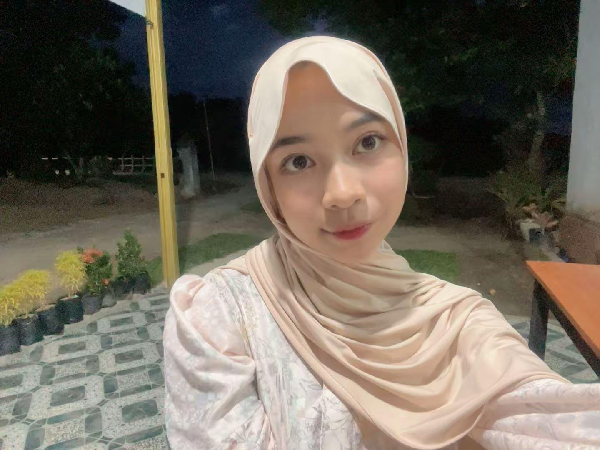

            

                <h2>
                    Upik Larasati
                </h2>

                

                    Haloo!! 

                    Saya Upik Larasati 

                    Bisa dipanggil Upi / Laras 

                    Saya mahasiswa semester 5
                    di Program Studi Teknik Geomatika
                    Institut Teknologi Sumatera.

                

                

                    Saya lahir di Bandung Baru,
                    tanggal 02 Januari 2006 

                    Alamat saya di Bandung Baru,
                    Kec. Adiluwih,
                    Kab. Pringsewu,
                    Prov. Lampung

                

            

        

    </section>

    <!-- ==============================
         RIWAYAT PENDIDIKAN
    ============================== -->

    <section id="riwayat-pendidikan" class="tab">

        <h1>
            Riwayat Pendidikan
        </h1>

        

            <h2>
                S1 Teknik Geomatika
            </h2>

            

                <b>
                    Institut Teknologi Sumatera (ITERA)
                </b>
            

            

                Program Studi Teknik Geomatika - S1
            

            

                2024 - Sekarang
            

             

            

                <b>
                    SMA NEGERI 1 SUKOHARJO
                </b>
            

            

                Jurusan Matematika dan
                Ilmu Pengetahuan Alam
            

            

                2021 - 2024
            

        

        <!-- SMA -->

        

            <h2 class="education-title">
                📚 Masa SMA
            </h2>

            

                

                    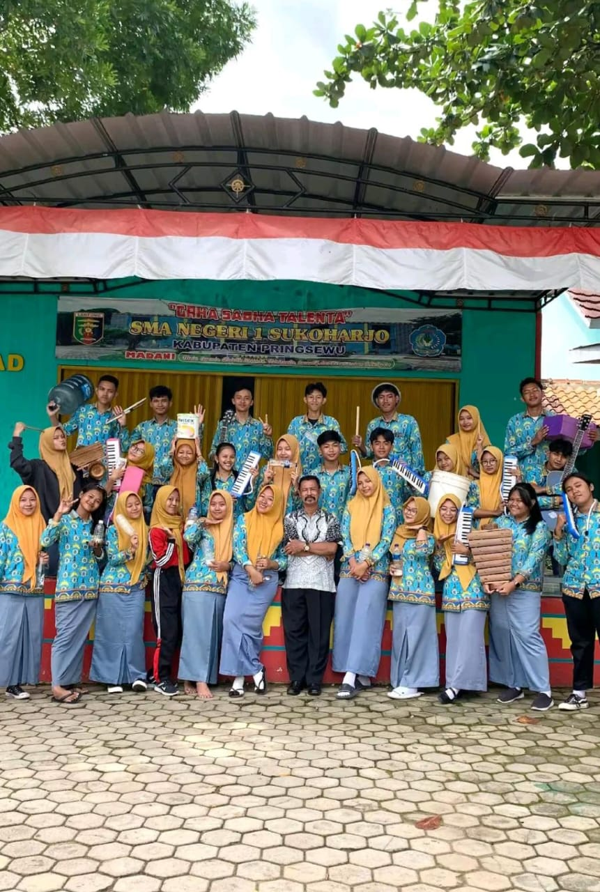

               

                

                

                    

                   
                

                

                    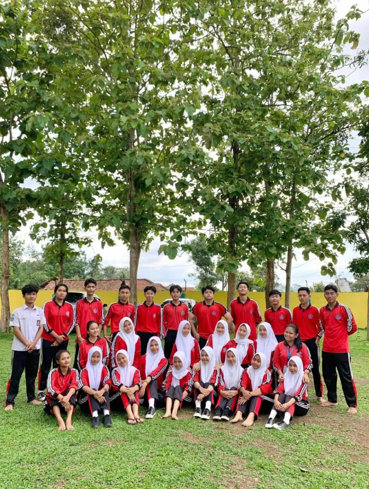

                  
                

                

                    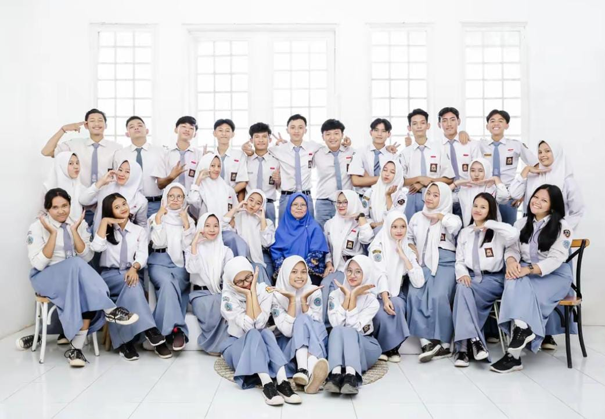

                   
                

            

        

        <!-- KULIAH -->

        

            <h2 class="education-title">
                🎓 Masa Kuliah
            </h2>

            

                

                    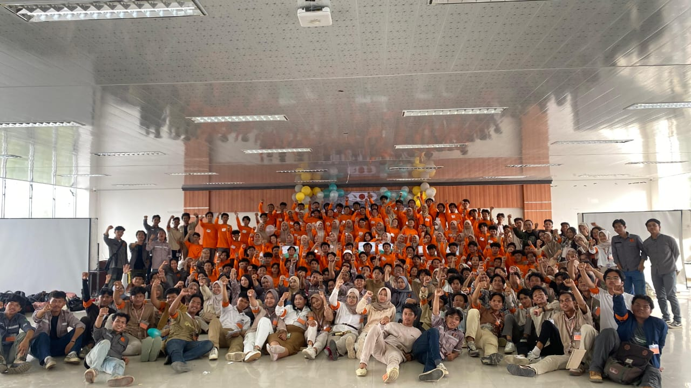

                    
                

                

                    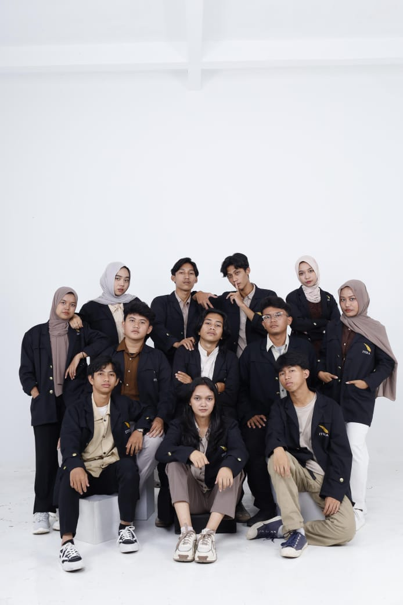

                    
                

                

                    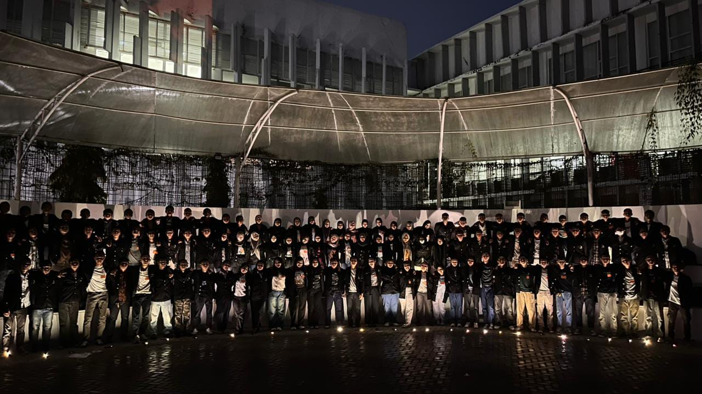

                  

                

                

                    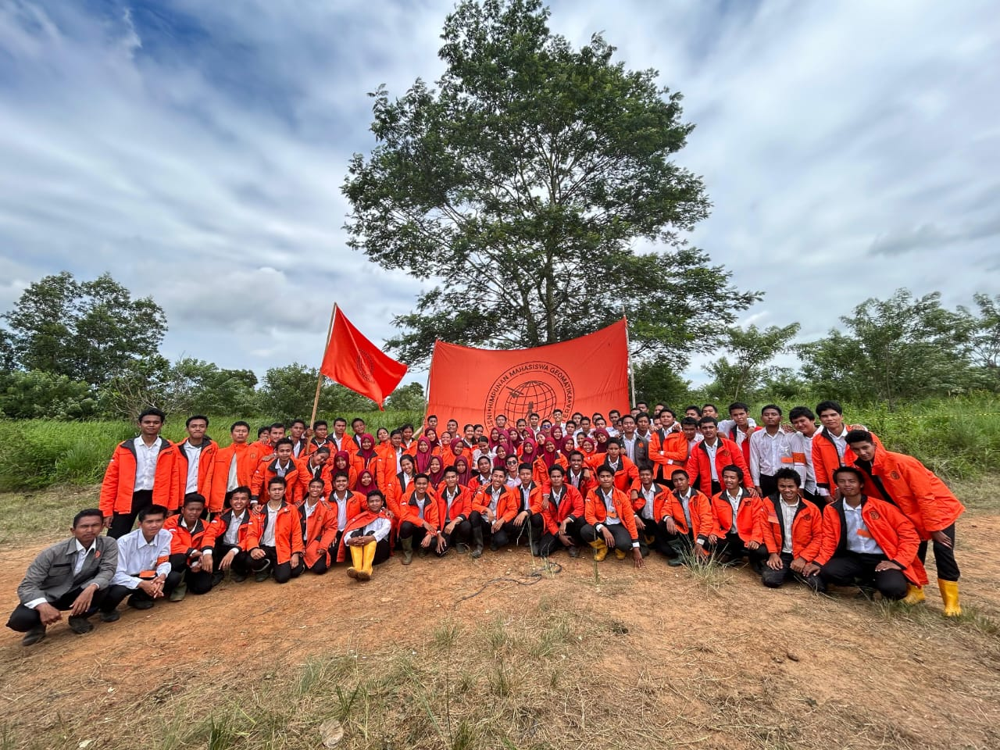

                    
                

            

        

    </section>

    <!-- ==============================
         PRESTASI
    ============================== -->

    <section id="prestasi" class="tab">

        <h1>
            Prestasi
        </h1>

        

            

                

                

                    <h3>
                        Finalis LOGIN Mercator
                    </h3>

                    

                        Finalis LOGIN Mercator -
                        National Scientific Paper Competition
                        Universitas Gadjah Mada, 2026.
                    

                

            

            

                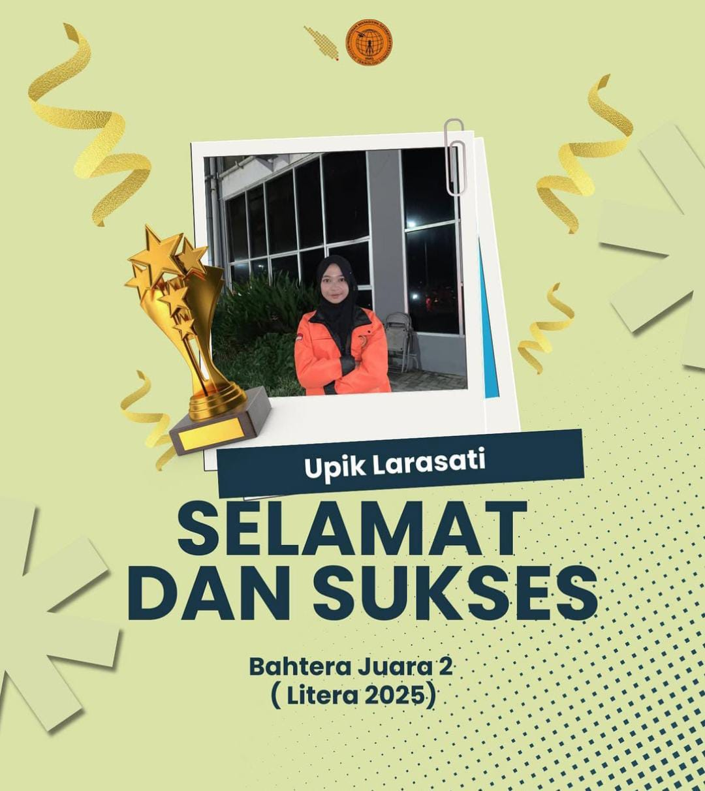

                

                    <h3>
                        Juara 2 Bahtera Litera
                    </h3>

                    

                        Juara 2 Bahtera Litera Competition
                        tingkat nasional, 2025.
                    

                

            

            

                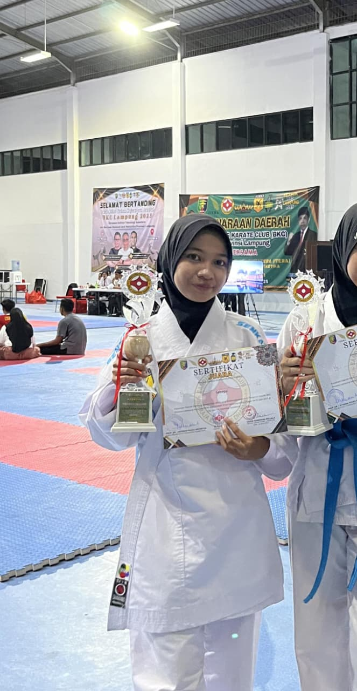

                

                    <h3>
                        Juara 1 Kumite
                    </h3>

                    

                        Juara 1 kategori Kumite
                        pada BKC Championship, 2025.
                    

                

            

            

                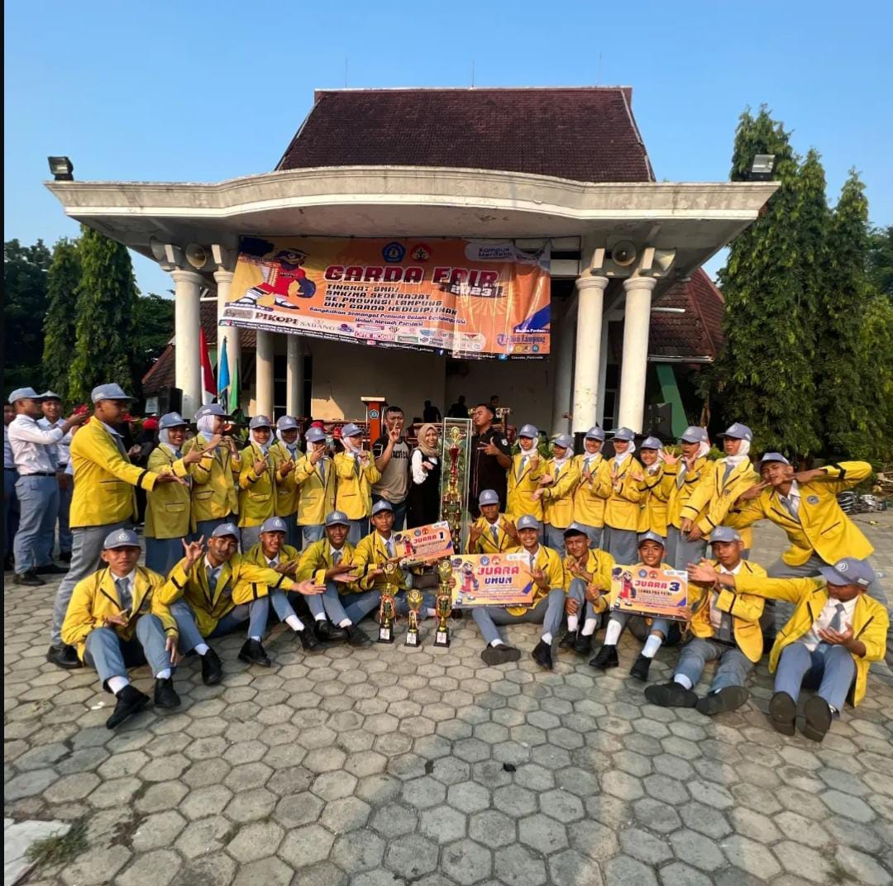

                

                    <h3>
                        Juara 1 FPB Garda Fair
                    </h3>

                    

                        Juara 1 FPB Garda Fair
                        tingkat Provinsi Lampung, 2023.
                    

                

            

            

                

                

                    <h3>
                        Juara 3 PBB Putri
                    </h3>

                    

                        Juara 3 kategori PBB Putri
                        Garda Fair tingkat Provinsi Lampung,
                        2023.
                    

                

            

            

                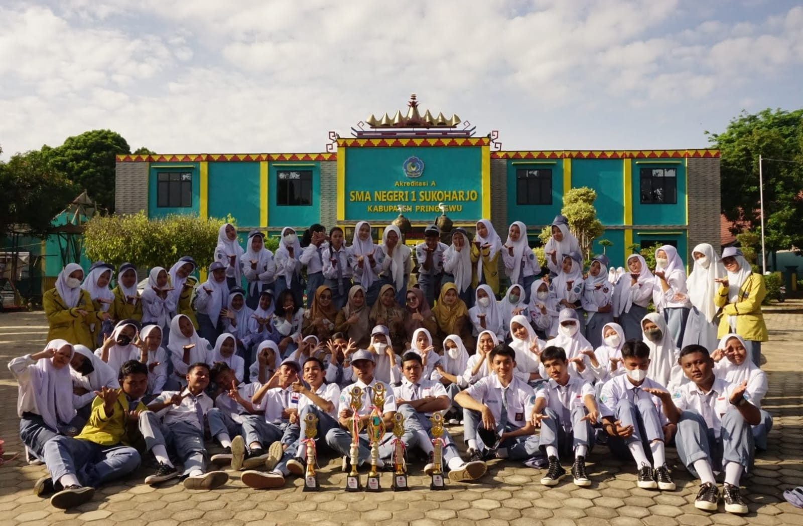

                

                    <h3>
                        Juara 2 Melody FYBI
                    </h3>

                    

                        Juara 2 Melody FYBI Pringsewu,
                        2022.
                    

                

            

            

                

                

                    <h3>
                        Runner-up PBB Putri
                    </h3>

                    

                        Runner-up PBB Putri Garda Fair
                        tingkat Provinsi Lampung, 2022.
                    

                

            

            

                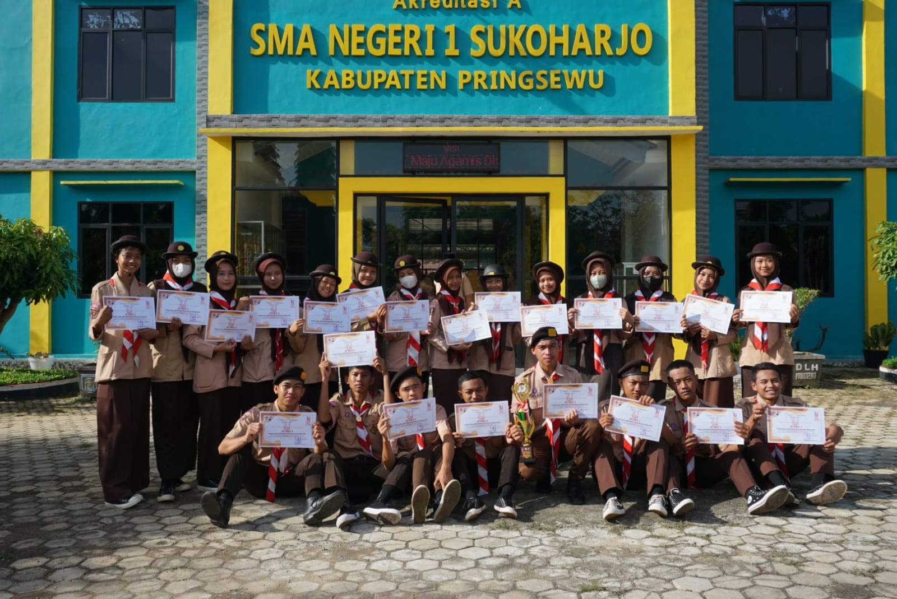

                

                    <h3>
                        Juara 3 LKBB Configuration
                    </h3>

                    

                        Juara 3 LKBB Configuration
                        tingkat kabupaten, 2022.
                    

                

            

        

    </section>

    <!-- ==============================
         PEMINATAN
    ============================== -->

    <section id="peminatan" class="tab">

        <h1>
            Peminatan
        </h1>

        

            

                <h3>
                    <i class="fa-solid fa-map"></i>
                    Sistem Informasi Geografis
                </h3>

                

                    Memiliki ketertarikan pada pengolahan,
                    analisis, dan penyajian data spasial
                    menggunakan Sistem Informasi Geografis.
                

            

            

                <h3>
                    <i class="fa-solid fa-compass"></i>
                    Kartografi
                </h3>

                

                    Tertarik pada pembuatan peta,
                    visualisasi data spasial,
                    serta penyajian informasi geografis
                    agar mudah dipahami.
                

            

            

                <h3>
                    <i class="fa-solid fa-earth-americas"></i>
                    Penginderaan Jauh
                </h3>

                

                    Memiliki ketertarikan dalam pemanfaatan
                    citra penginderaan jauh untuk memperoleh
                    informasi mengenai permukaan bumi.
                

            

            

                <h3>
                    <i class="fa-solid fa-laptop-code"></i>
                    Software
                </h3>

                

                    Terbiasa menggunakan beberapa software
                    yang mendukung kegiatan pengolahan
                    dan analisis data geospasial.
                

            

        

          

        <!-- SKILL BARS -->

        

            

                

                    

                        
                            QGIS
                        

                        
                            85%
                        

                    

                    

                        

                        

                    

                

                

                    

                        
                            ArcGIS
                        

                        
                            80%
                        

                    

                    

                        

                        

                    

                

                

                    

                        
                            Kartografi
                        

                        
                            75%
                        

                    

                    

                        

                        

                    

                

            

        

    </section>

    <!-- ==============================
         MOUNTAIN JOURNEY
    ============================== -->

    <section id="mountain-journey" class="tab">

        <h1>
            Mountain Journey
        </h1>

        

            

                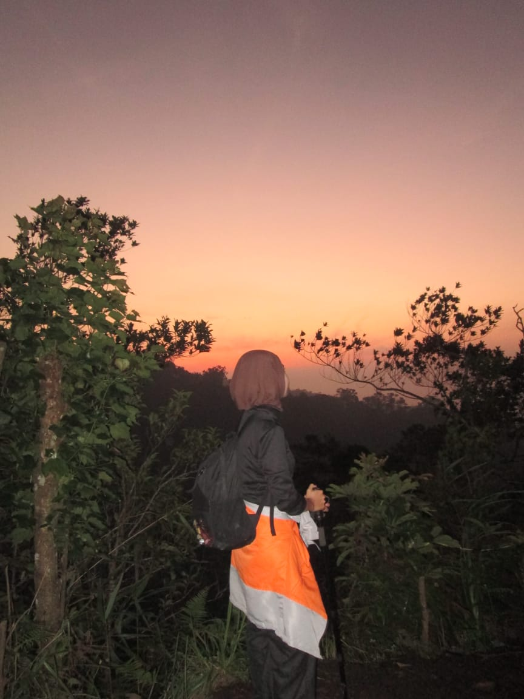

                

                    <h3>
                        MT. NIRWANA
                    </h3>

                    

                        1681 MDPL
                    

                

            

            

                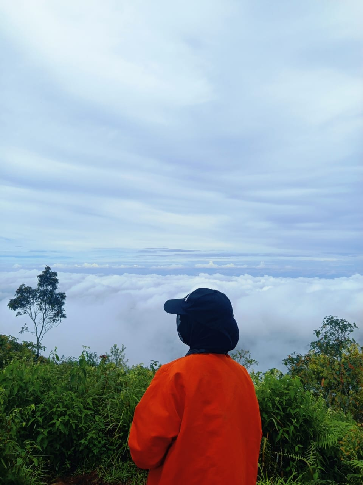

                

                    <h3>
                        MT. SERIBU
                    </h3>

                    

                        1661 MDPL
                    

                

            

            

                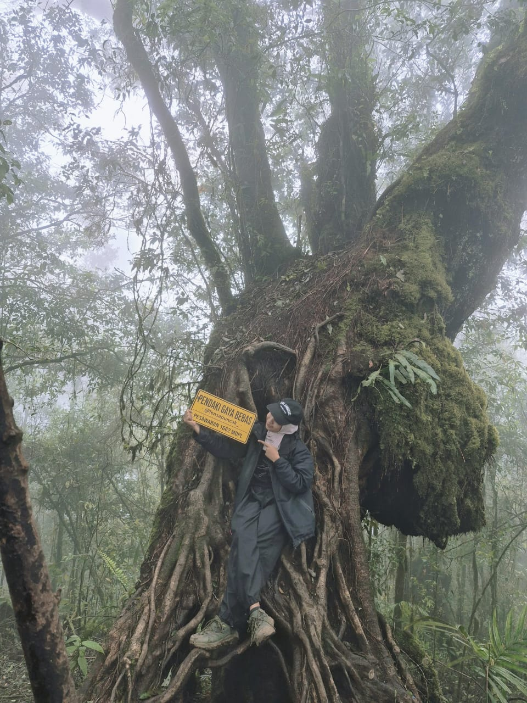

                

                    <h3>
                        MT. PESAWARAN
                    </h3>

                    

                        1662 MDPL
                    

                

            

            

                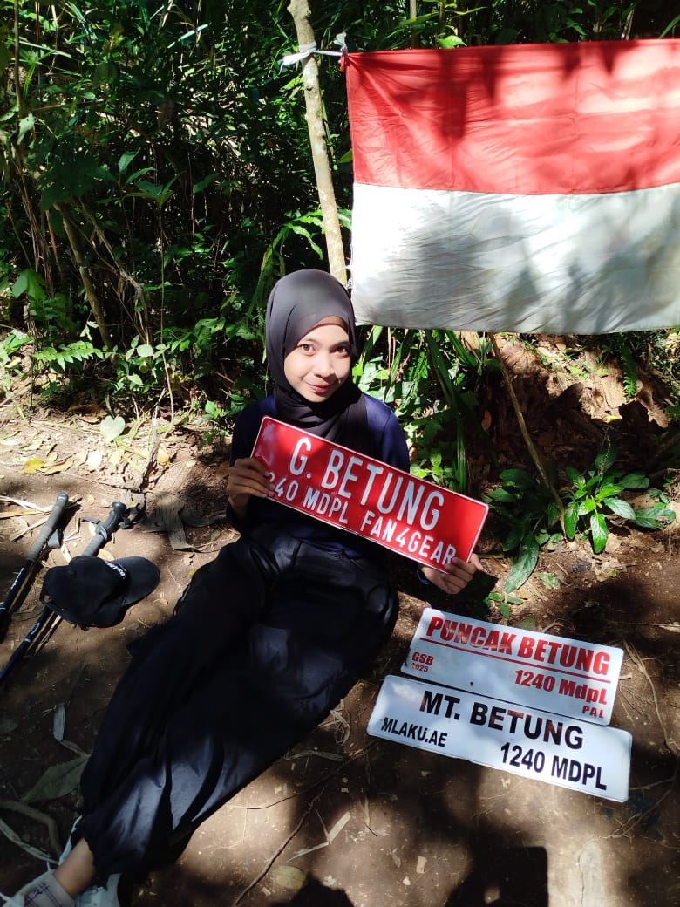

                

                    <h3>
                        MT. BETUNG
                    </h3>

                    

                        1240 MDPL
                    

                

            

            

                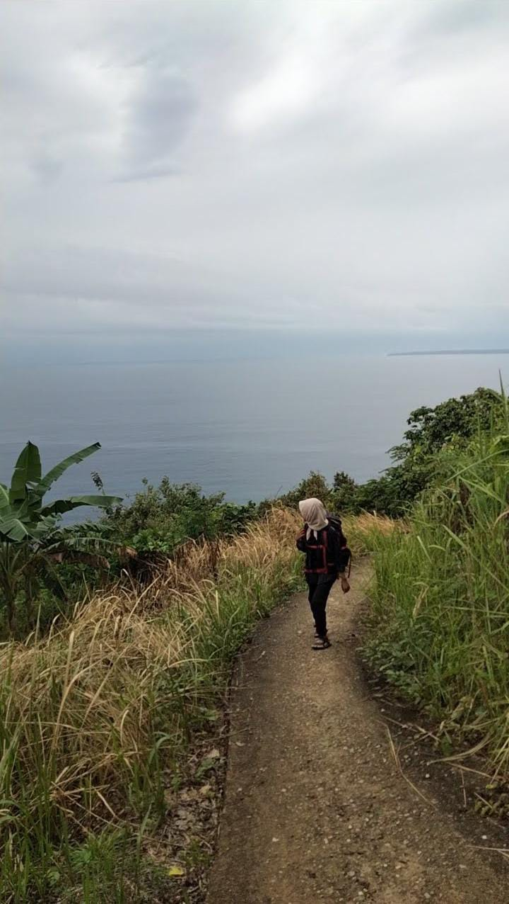

                

                    <h3>
                        MT. TABUHAN
                    </h3>

                    

                        671 MDPL
                    

                

            

            

                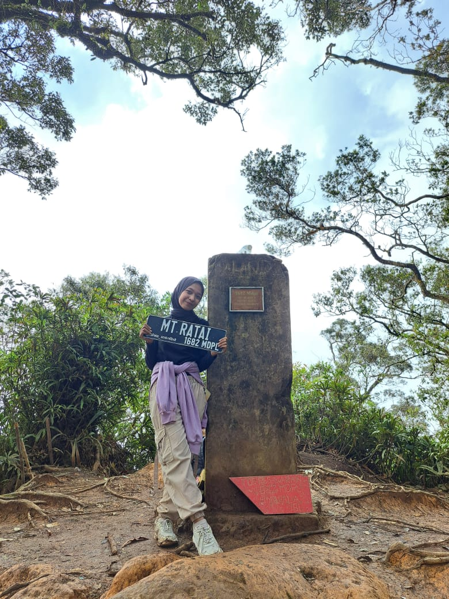

                

                    <h3>
                        MT. RATAI
                    </h3>

                    

                        1682 MDPL
                    

                

            

        

    </section>

    <!-- ==============================
         KONTAK
    ============================== -->

    <section id="kontak" class="tab">

        <h1>
            Kontak
        </h1>

        

            

                <i class="fa-solid fa-envelope"></i>

                

                    <h3>
                        Email
                    </h3>

                    

                        <a href="mailto:upik.124230009@student.itera.ac.id">
                            upik.124230009@student.itera.ac.id
                        </a>
                    

                

            

            

                <i class="fa-brands fa-whatsapp"></i>

                

                    <h3>
                        WhatsApp
                    </h3>

                    

                        <a href="https://wa.me/6288275454978"
                           target="_blank">
                            +62 882 7545 4978
                        </a>
                    

                

            

            

                <i class="fa-brands fa-instagram"></i>

                

                    <h3>
                        Instagram
                    </h3>

                    

                        <a href="https://instagram.com/u_pii.laras"
                           target="_blank">
                            @u_pii.laras
                        </a>
                    

                

            

            

                <i class="fa-solid fa-location-dot"></i>

                

                    <h3>
                        Location
                    </h3>

                    

                        Lampung, Indonesia
                    

                

            

        

    </section>

    <!-- ==============================
         FOOTER
    ============================== -->

    <footer>

        © 2026 Upik Larasati |
        Website Profil Pribadi

    </footer>

</body>
</html>
